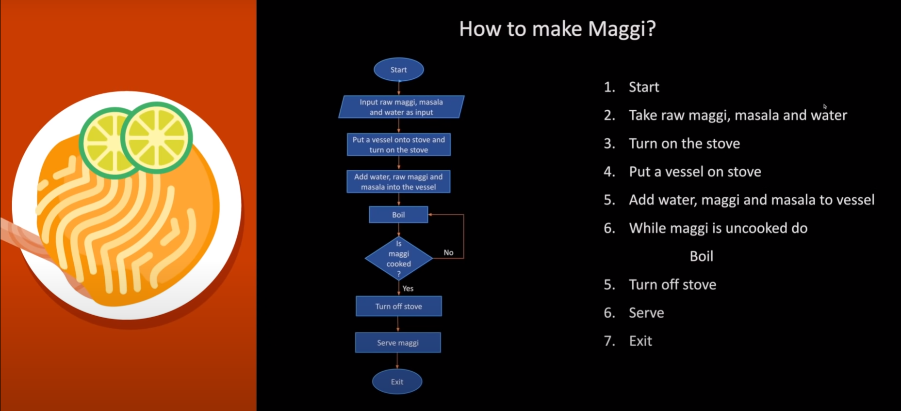
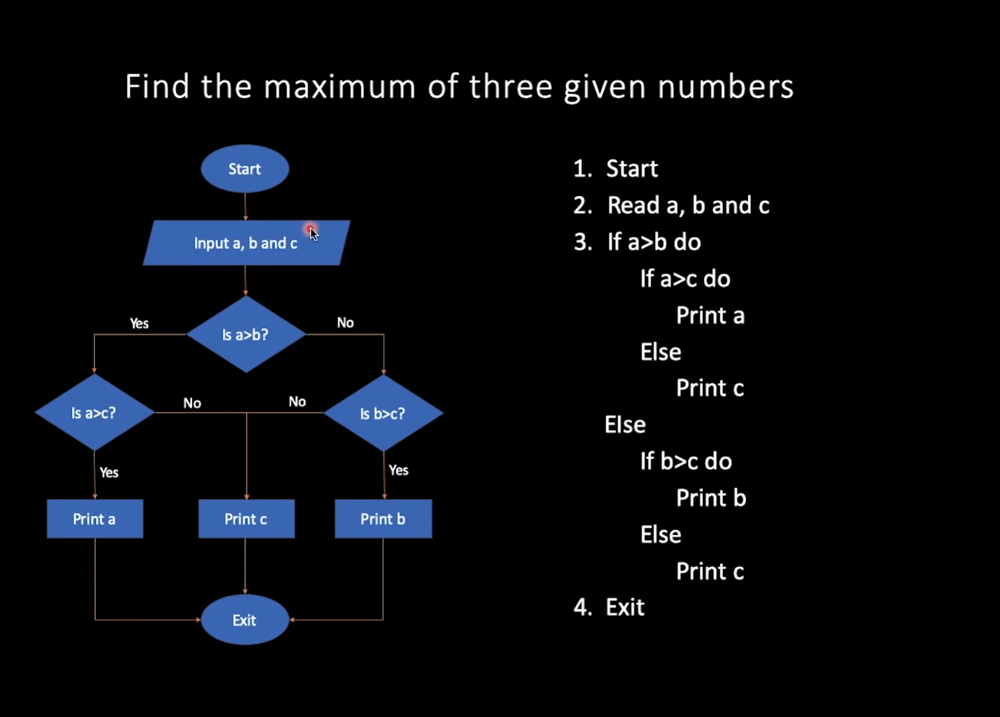
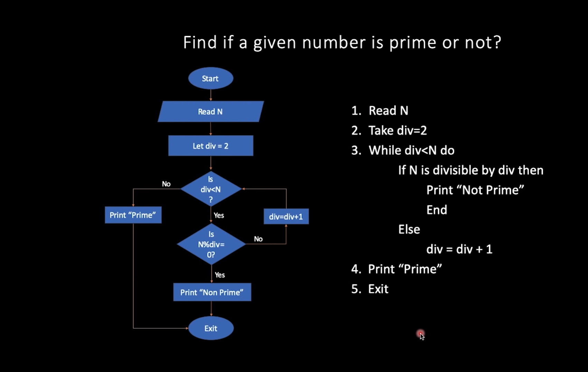
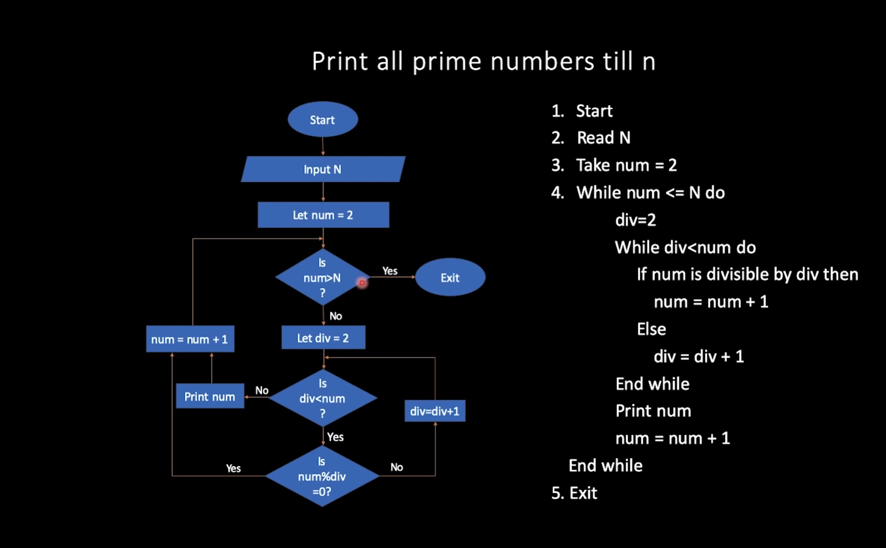
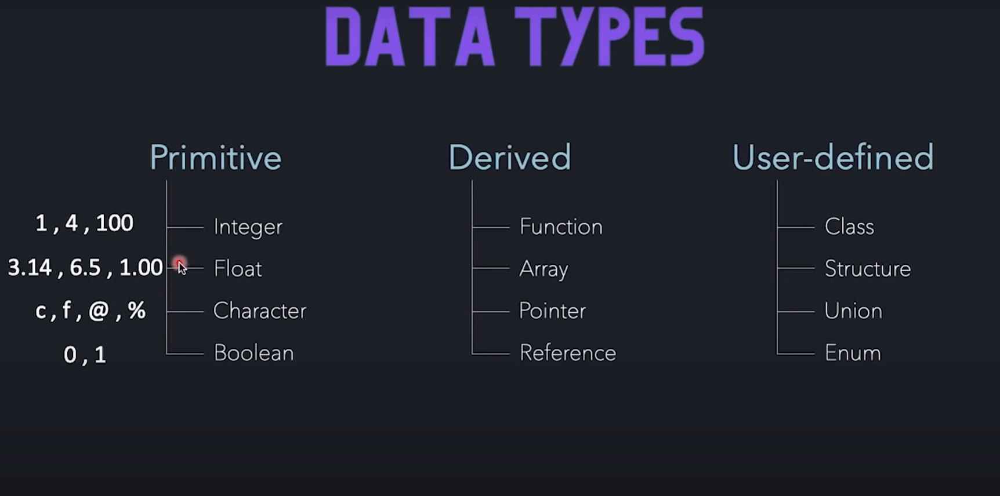
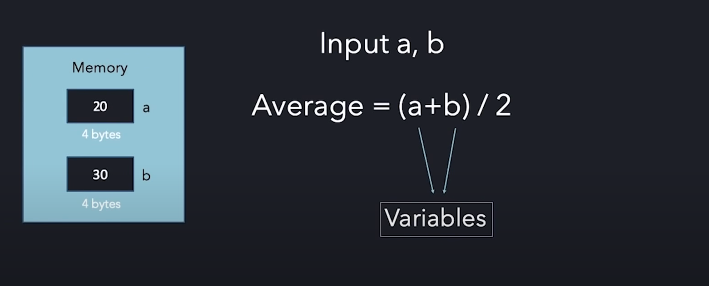

# Introduction to C++ DSA
### Points to remember
* How to compile a c++ program ```c++ -o test test.c```
* How execute a c++ program ```./test```
* c++ uses a compiler which convert the code written in c++ into a binary format that a machine can understand.  
* So we are using c++ as a language to give instructions to the computer to perform a task.
* ```cin>>a>>b;``` cin here is used here to input values of variables in run time here we are entering values of multiple variables at the same time using just one cin.
* ```cout<<a+b<<"\n";``` cout is used to print the output or a messege in the terminal during or after the c++ program execution.

##### Flow chart to find maximum of 3 numbers

##### Flow chart to find The number is prime or not

##### Flow chart to print the prime numbers from 1 to n

### c++ data types
| Data types  | size int bytes |
| :------------ |:---------------:|
| char      | 1 |  
| int       | 4 |
| long      | 8 |
| float      | 4 |
| double      | 8 |  
##### Primitive data types

##### Variables and constants

